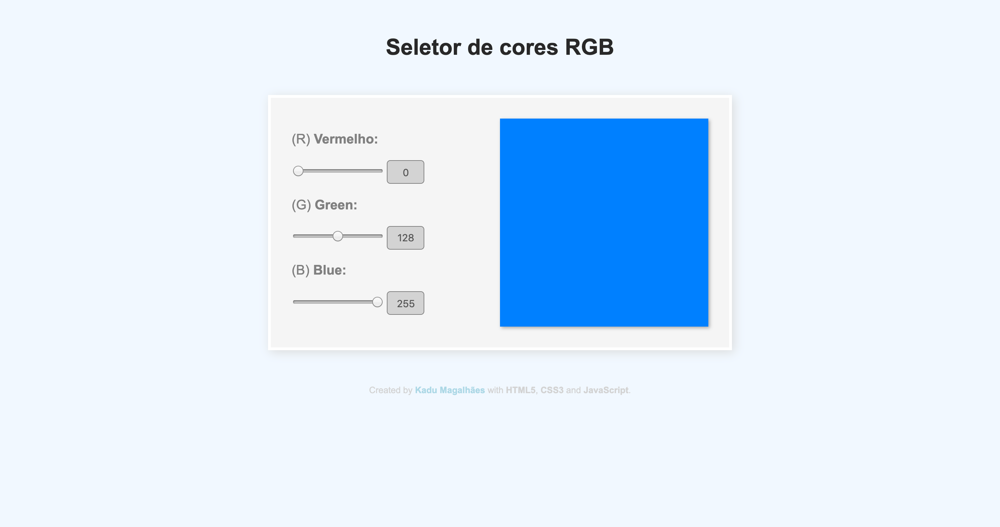

# Seletor de cores em JS
Primeiro trabalho prático do Bootcamp Dev Fullstack da IGTI

## Enunciado

Construa, utilizando HTML, CSS e JavaScript puro, uma aplicação para a visualização de cores a partir da escala RGB.

### Resultado

